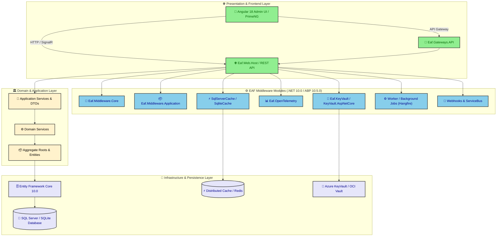
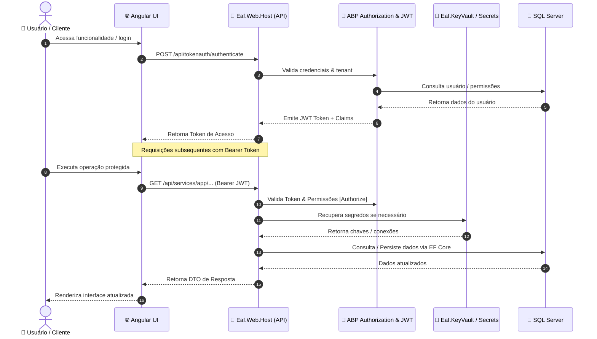

# EAF (Enterprise Application Foundation) — System Architecture

> Arquitetura de alto nível do ecossistema EAF, abrangendo a camada de apresentação, módulos de middleware baseados em ASP.NET Boilerplate (ABP) .NET 10.0, e infraestrutura de persistência e serviços corporativos.

## 1. Visão Geral da Arquitetura (C4 / Componentes)

## 2. Fluxo de Requisição e Autenticação (Sequence)

## 3. Módulos de Middleware EAF

O EAF fornece 14 módulos reutilizáveis organizados em camadas modulares:
1. **Eaf.Middleware.Core**: Núcleo corporativo, exceções de negócio, tempo e extensões base.
2. **Eaf.Middleware.Application**: Serviços de aplicação base, validações e DTOs padronizados.
3. **Eaf.Middleware.Web.Core**: Filtros globais, tratamento de erros HTTP e integração com ASP.NET Core.
4. **Eaf.KeyVault & KeyVault.AspNetCore**: Gerenciamento integrado de segredos (Azure KeyVault, OCI Vault).
5. **Eaf.OpenTelemetry**: Observabilidade distribuída com métricas, traces e PII redaction.
6. **Eaf.SqlServerCache / SqliteCache**: Cache distribuído de alta performance.
7. **Eaf.Worker**: Processamento de tarefas em segundo plano com Hangfire.
8. **Eaf.Log4NetServiceBus**: Log estruturado e mensageria integrada.
